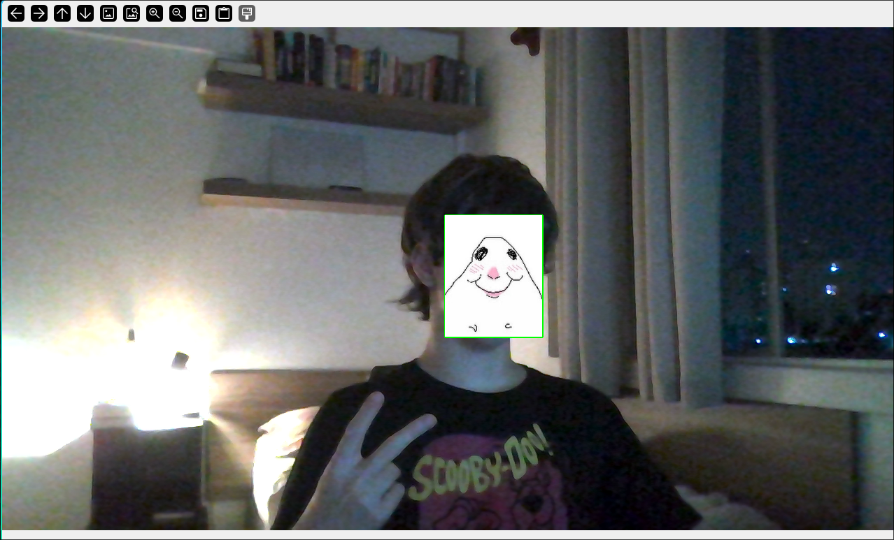

# estudos PRIM
materialzinho pra estudar pra prova de Processamento de Imagens !!!

recomendo seguir na ordem que estiver abaixo

## arquivos

1. `cover_face.py`: coloca uma imagem na frente do rosto. Mostra o básico de como lidar com vídeo e como colocar uma imagem dentro da outra (com o numpy!)


2. chroma key (em andamento.......)


## como rodar
primeiro chequem se o PC de vcs tem python e o pip:
```
python --version
pip --version
```
depois é só instalar esses pacotes:

no Windows
```
pip install numpy opencv-python
```

no Mac
```
pip3 install numpy opencv-python
```

depois só rodar um 
```
python *nome do exercicio*
```
